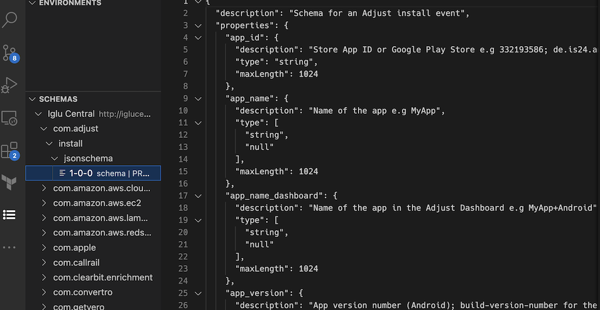
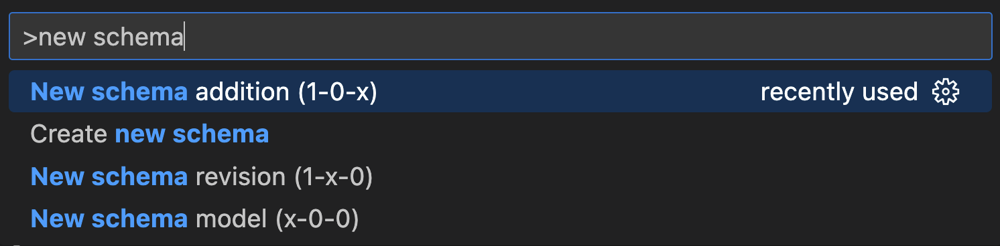
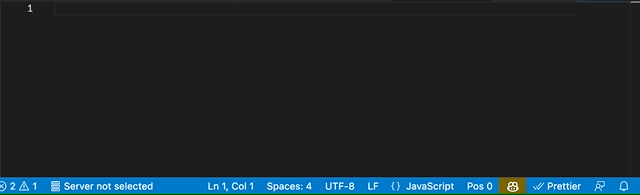

# snowboard README

Snowboard is a [Visual Studio Code](https://code.visualstudio.com/) extension for working with the [Snowplow](https://snowplow.io/) Behavioral Data Platform.

The focus at the moment is to improve workflows for working with [Iglu](https://docs.snowplow.io/docs/pipeline-components-and-applications/iglu/) schemas.

The goal is to improve the developer experience implementing instrumentation for Snowplow Events and Entities across any language.

## Features

- Schema discovery
  - Show schemas found in current workspace, Iglu Central, and Snowplow Console Data Structures API
  - Clicking a schema will fetch it from the remote server for display
  
  - Iglu URIs in code should now open respective schema if it is resolvable
- Drag & Dropping schemas into code generates a language-appropriate tracking call

- Command Palette commands for creating new schemas and schema versions

- JSON Schema language awareness for Iglu-style files (`*/jsonschema/*-*-*`)

### Snippets

- Tracking code snippets for many languages with supported Snowplow Tracking SDKs

### Commands

- New schema
- New addition / revision / model from an existing schema
- Generate fake data from Snowplow schema

### Roadmap

- Autocompletion of iglu: URIs (using the iglu: prefix) for known schemas
- Generate full sample event payloads in tracking snippets
- Support custom static Iglu repos
- More human-friendly display of schemas
- Schema authoring functionality
- Generate schemas from existing type definitions
- Event validation/testing/confirmation (via e.g. [Snowplow Micro](https://github.com/snowplow-incubator/snowplow-micro) or [Snowplow Mini](https://docs.snowplow.io/docs/understanding-your-pipeline/what-is-snowplow-mini/ )
- Diagnostics for bad rows

## Requirements

Full custom schema functionality may require an API key to a Snowplow BDP Console account.

## Development

To test, open the extension hit 'F5' to run and functionality should then be available in the newly opened vs code window.

## Known Issues

Simulating fake data has some limitations when using the 'faker' extension as some providers appear to be unavailable.

## Release Notes
### 0.0.1
Initial release of the Poplin Snowboard VS code extension
